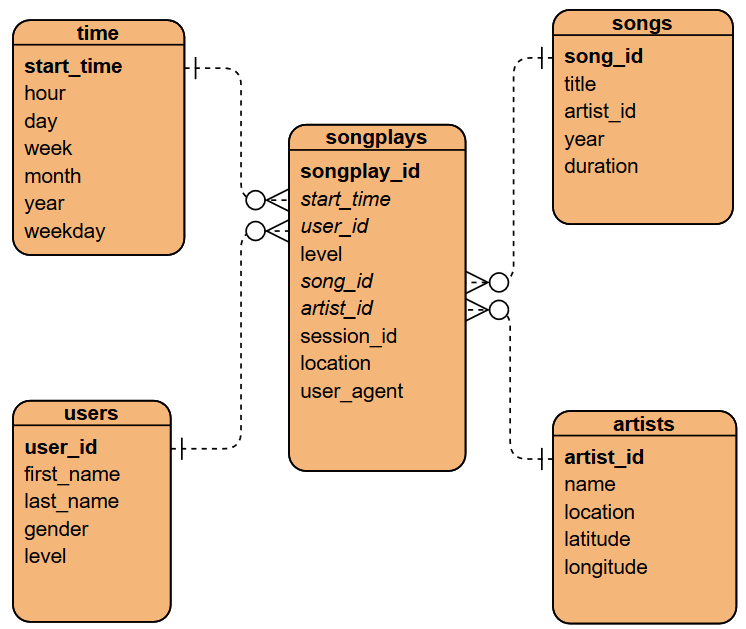

# Data Pipelines with Apache Airflow

  

### Project from Udacity Data Engineering nanodegree
This project places myself as a Data Engineer for a fictional music streaming company called Sparkify. 
They have decided to automate and monitor their data warehouse ETL pipelines with Airflow.
The raw metadata resides on S3 as raw JSON files and needs to be processed in Sparkify's data warehourse in Amazon Redshift.

### Objectives
Create an Airflow data pipeline that stages the raw metadata from S3 to Redshift, and processes the data into fact and dimension tables. 
The tasks must be built with flexible reusable operators, allow for easy backfills and be easily monitored. 
Data quality checks must be run after the ETL tasks have been executed. 

*The final Data Pipeline, or DAG (Directed Acyclic Graph) was designed with the processing flow shown above.*
*Each box represents a task as defined in* **dags/primary_day.py**

### Song JSON data 
The first dataset is a subset of real data from the [Million Song Dataset](http://millionsongdataset.com/).  
Each JSON file has metadata for a particular track, with the following fields:
- *num_songs, artist_id, artist_latitude, artist_longitude, artist_location, artist_name, song_id, title, duration, year*

### Log JSON data  
The second dataset is user songplay log files in JSON format generated by this [event simulator](https://github.com/Interana/eventsim). 
These simulate activity logs from a music streaming app based on specified configurations.  
Below is an example of what the data in 2018-11-12-events.json looks like:  
  

### Data Warehouse Schema
The image below shows the structure of the final analytic tables. 
It is a typical STAR schema, with the fact table (songplays) and 4 dimension tables. 
It is optimized for analytic queries to answer any questions on user songplay behavior! 

### Airflow setup with Docker
**IMPORTANT:** To reproduce my project, please ensure you have Docker activated, and then clone this popular Airflow Docker image:
`git clone https://github.com/puckel/docker-airflow`

### Instructions and workflow (assuming a Linux setup)
1. Complete the empty fields from **./dwh.cfg** and **credentials.cfg** with your desired Redshift options and AWS credentials.
    - **DO NOT** *uncomment the section headers or else the shell script will not load them properly* 
2. At the top of **./run.sh,** enter the cloned Puckel docker-airflow path, and if desired, revised paths for the redshift and credential config files.
3. Execute **./run.sh** by typing `./run.sh` into the terminal from this repo's root level folder. The bash file performs the following tasks:
    - Copies the modified **CeleryExecutor.yml** file to the docker-airflow folder (so Airflow is setup with a workable configuration)
    - Fires up Airflow using Docker Compose and CeleryExecutor! Waits until both Airflow and Redshift are ready.
    - Spins up a Redshift cluster based on **./dwh.cfg** parameters
    - Creates the Airflow connections and IAM ARN variable from the host machine
    - Activates the DAG. NOTE: Please monitor the DAGs progress on the webserver UI [localhost:8080](http://localhost:8080/)
    - Invites the user into the Redshift connection to explore the tables from the terminal!

### Extra work completed   
- Automated most of the workflow using Linux bash scripting **(run.sh)** and the Airflow Command Line Interface (CLI) tool.
- Simple and dynamic operators, with as little hard coding as possible
